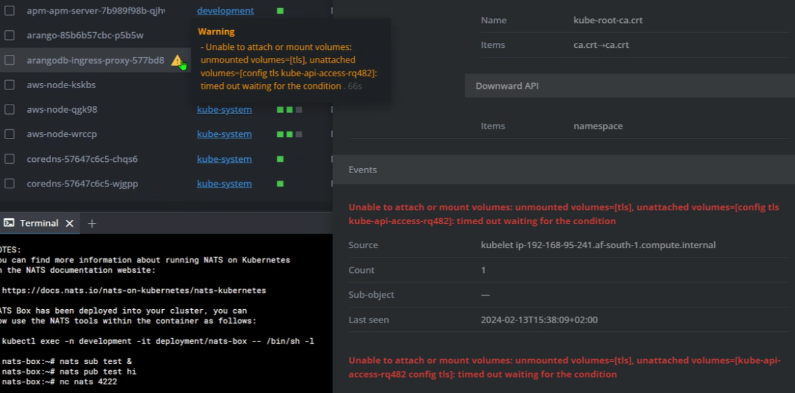
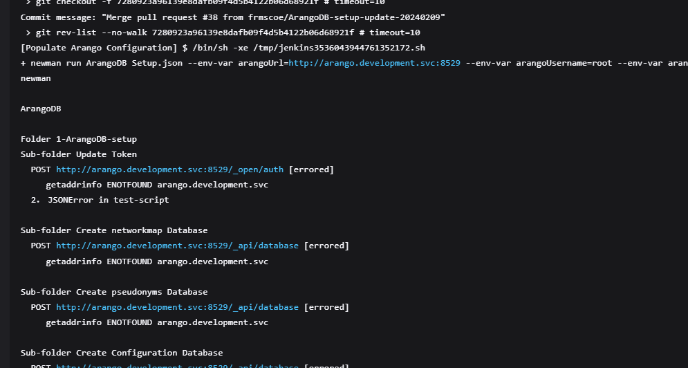
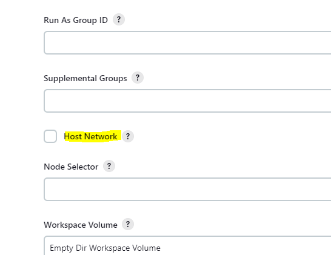
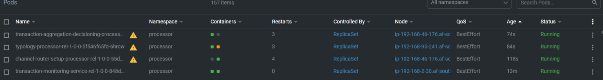
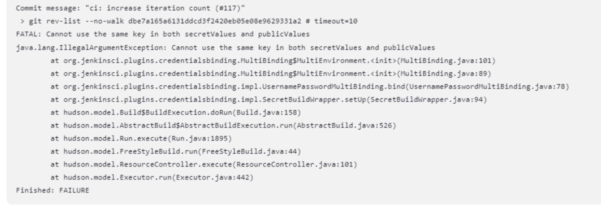
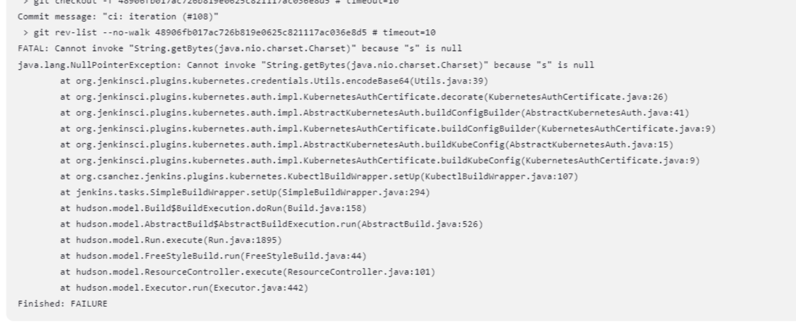
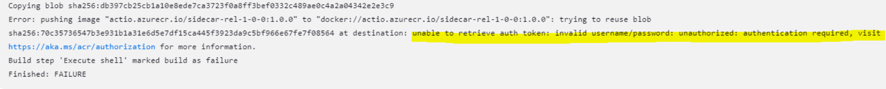

# On-Premise Detailed Installation Guide

This guide provides a comprehensive walkthrough for deploying Tazama on an on-premises Kubernetes cluster. It includes provisioning the infrastructure, as well as provide options to install the rest of the tazama stack using jenkins.

## Table of Contents

- [On-Prem Deployment Overview](#Getting-Started)
- [Using the Infrastructure chart](#Using-the-Infrastructure-chart)
  - [Configuring the Chart](#Configuring-the-Chart)
  - [Full Installation](#Full-Installation)
  - [No Auth Installation](#No-Auth-Installation)
  - [No Advanced Monitoring Installation](#No-Advanced-Monitoring-Installation)
- [Deploying Tazama Processors](#Deploying-Tazama-Processors)
  - [Jenkins](#jenkins)
  - [Direct Deployment](#Direct-Deployment)
- [Common Errors](#common-errors)
  - [Arango Ingress Error](#arango-ingress-error)
  - [Network Access Error in Container Deployment](#network-access-error-in-container-deployment)
  - [Addressing Pod Restart Issues in Kubernetes](#addressing-pod-restart-issues-in-kubernetes)
  - [Addressing Jenkins Build Authentication Errors](#addressing-jenkins-build-authentication-errors)
  - [Jenkins Build Agent Terminating and Restarting](#jenkins-build-agent-terminating-and-restarting)
  - [Forbidden User on Jenkins Job Builds](#forbidden-user-on-jenkins-job-builds)
- [Developer Notes](#Developer-Notes)
- [Conclusion: Finalizing Tazama System Installation](#conclusion-finalizing-tazama-system-installation)

### Getting Started

This Repository contains all the helm charts used by Tazama. Inside the Infrastructure Folder you will find a chart that will install all dependencies for tazama.

**The list below are the different helm charts:**

1. NATS
2. ElasticSearch
3. Postgres
4. PgAdmin4
5. Jenkins
6. Infra-chart
7. APM (Elasticsearch)
8. Logstash (Elasticsearch)
9. Kibana (Elasticsearch)
10. Grafana - **Optional**
11. Prometheus - **Optional**
12. KeyCloak - **Optional**

**Important:** Access to the Tazama GIT Repository is required to proceed. If you do not currently have this access, or if you are unsure about your access level, please reach out to the Tazama Team to request the necessary permissions. It's crucial to ensure that you have the appropriate credentials to access the repository for seamless integration and workflow management.

**Optional** - Please note that these are additional features; while not required, they can enhance the platform's capabilities. Implementing them is optional and will not hinder the basic operation or the end-to-end functionality of the platform.

All of the Charts use their officialy supported Helm charts with the exception of Postgress and PgAdmin, where official helm charts does not exist at this time. Instead they are located in [CustomCharts](Infrastructure/customCharts/), and will automaticly be pulled into the /charts folder being created when you run the startup commands.

To start off, navigate to the Infrastructure Folder and open up a command terminal. Run the following commands: 

```bash
helm repo update
```

and 

```bash
helm dependency build
```

This will pull all the helm charts required and create a "/charts" repository.

### Step 1: Using the Infrastructure chart

#### Configuring the Chart

To Configure which services will be deployed, navigate to ./Infrastructure/Values.yaml. Once inside you will see each component with an enable flag set to true by default. From here you can enable/disable components you don't want to install. Should you disable a components, you also won't need to pass through their values.yaml file when you deploy them.

Next is a few common installation options:

##### Full Installation

For a Full installation containing all infrastructure componenets required to run tazama as well as all optional componenets, open a command terminal and navigate to ./Infrastructure. Once there run the command:

```bash
helm install tazama . -f values.yaml -f values-grafana.yaml -f values-jenkins.yaml -f values-nats.yaml -f values-pgadmin.yaml -f values-prometheus.yaml -f values-kibana.yaml -f values-grafana.yaml -f values-elastic.yaml -f values-apm.yaml -f values-postgres.yaml -f values-pgadmin.yaml
```

This will install the entire infrastructure suite, including all optional components.

##### No Auth Installation

Start off by disabling keycloak inside the values.yaml file.

```
  keycloak:
    enabled: false
```

Then open a command terminal and navigate to ./Infrastructure. Once there run the command:

```bash
helm install tazama . -f values.yaml -f values-grafana.yaml -f values-jenkins.yaml -f values-nats.yaml -f values-pgadmin.yaml -f values-prometheus.yaml -f values-kibana.yaml -f values-grafana.yaml -f values-elastic.yaml -f values-apm.yaml -f values-postgres.yaml -f values-pgadmin.yaml
```

This will install the entire infrastructure suite, excluding keycloak.

##### No Advanced Monitoring Installation

Start off by disabling Prometheus, Kibana and Grafana inside the values.yaml file.

```
  prometheus:
    enabled: false

  kibana:
    enabled: false

  grafana:
    enabled: false
```

Then open a command terminal and navigate to ./Infrastructure. Once there run the command:

```bash
helm install tazama . -f values.yaml -f values-grafana.yaml -f values-jenkins.yaml -f values-nats.yaml -f values-pgadmin.yaml -f values-elastic.yaml -f values-apm.yaml -f values-postgres.yaml -f values-pgadmin.yaml
```

This will install the entire infrastructure suite, excluding the advanced monitoring.

### Step 2: Deploying Tazama Processors

Next up you have to deploy the Tazama platform. Currently we support the following methods -

#### Jenkins

Using the Jenkins approach you will have to import the Jobs found in the: jenkins-setup folder. For more instructions on how to do that and a full guide on Jenkins, go [Here](./jenkins-setup/README.md)

#### Direct Deployment

You can also navigate to each repo individualy and apply their deployment.yaml files.

- [Transaction Monitoring System](https://github.com/tazama-lf/tms-service)
- [Event Director](https://github.com/tazama-lf/event-director)
- [Typology Processor](https://github.com/tazama-lf/typology-processor)
- [Transaction Aggregation and decisioning processor](https://github.com/tazama-lf/transaction-aggregation-decisioning-processor)
- [Event Flow](https://github.com/tazama-lf/event-flow)

### Common Errors\*\*



### Arango ingress error\*\*

To resolve this issue, you would need to:

1. Ensure that the `tlscomsecret` secret contains the necessary TLS certificates and keys.
2. Add the `tlscomsecret` to the `development` namespace, if it's not already present.
3. After the secret is correctly placed in the namespace, restart the affected pod by deleting the existing pod. Kubernetes will automatically spin up a new pod which should now successfully mount the required volumes, including the TLS secrets, and run as expected.



### Network Access Error in Container Deployment

To address the network access error encountered when deploying containers that require communication with `arango.development.svc`, follow these steps:

1. Verify that the network policies and service discovery configurations are correctly set up within your cluster to allow connectivity to `arango.development.svc`.

2. If your deployment is within a Kubernetes environment and you're using network namespaces, consider enabling the Host Network option. This grants the pod access to the host machine's network stack, which can be necessary if the service is only resolvable or accessible in the host's network:

- Navigate to the configuration settings of your pod or service deployment.
- Locate the "Host Network" option, which allows the pod to use the network namespace of the host machine.
- Enable the "Host Network" checkbox to allow direct access to the network services on the host, which can resolve DNS issues if `arango.development.svc` is only available on the host's network.

Implementing these steps should help in resolving connectivity issues related to the `arango.development.svc` hostname not being found, facilitating successful POST requests to the specified endpoints.



### Addressing Pod Restart Issues in Kubernetes

If you are experiencing problems with your Kubernetes pods that may be related to environmental variables or configuration issues, such as frequent restarts or failed connections to services like ArangoDB, follow these steps to troubleshoot and resolve the issue:

1. Check the Environment Variables in Jenkins:

- Ensure that all required environment variables are properly set in Jenkins. These variables might include database connection strings, service endpoints, credentials, or other configuration parameters necessary for your application to run correctly.
- Review the build and deployment scripts in Jenkins to confirm that the environment variables are being injected into the deployment manifests or pod configurations.

2. Verify ArangoDB Configuration:

- Double-check the ArangoDB configuration to ensure that it is correct and aligns with the requirements of your application. This may include database URLs, user credentials, database names, and any other related configuration details.
- If you are using Kubernetes ConfigMaps or Secrets to manage the ArangoDB configuration, make sure they are correctly defined and mounted into your pods.

3. Monitor Pod Status and Logs:

- Observe the status of the pods through the Kubernetes dashboard or using `kubectl get pods` command. Take note of any pods that are in a CrashLoopBackOff state or that are frequently restarting.
- Use `kubectl describe pod <pod-name>` to get more details about the pod's state and events that might indicate what is causing the restarts.
- Examine the logs of the restarting pods using `kubectl logs <pod-name>` to look for any error messages or stack traces that could point to a configuration problem or a missing environment variable.

4. Address Possible Configuration Drifts:

- In a dynamic environment like Kubernetes, configuration drifts can occur where the running state of the system deviates from the defined state. Ensure that all deployments, StatefulSets, or other controller resources match the intended configuration.

5. Update and Restart Pods if Necessary:

- Once any necessary changes have been made to the environment variables or ArangoDB configuration, update the relevant Kubernetes resources.
- You can restart the affected pods to apply the changes by deleting them and letting the ReplicaSet create new ones with the correct configuration.

By carefully checking your Jenkins environment variables and ensuring the ArangoDB configuration is correct, you can resolve issues leading to pod instability and ensure that your services run smoothly in the Kubernetes environment.





### Addressing Jenkins Build Authentication Errors

When encountering authentication errors during a Jenkins build process that involve Kubernetes plugin issues or Docker image push failures, follow these troubleshooting steps:

1. Kubernetes Plugin Error:

- The error message suggests a `NullPointerException`, which is often due to missing or improperly configured credentials within Jenkins. This could be an issue with the Kubernetes plugin configuration where a required value is not being set, resulting in a null being passed where an object is expected.
- Review your Jenkins job configurations and ensure that all the Kubernetes-related credentials are correctly set and that the plugin is properly configured.
- If you are using credential substitution (injected variables), ensure that the substitutions are correctly configured. If necessary, as per the provided instruction, deselect all credential substitutions to see if this resolves the error. This can help isolate the issue by reverting to default or hardcoded credentials, which can then be individually reinstated to identify the problematic substitution.

2. Docker Image Push Error:

- The failure to push a Docker image to a registry, with an error indicating "unable to retrieve auth token," typically points to incorrect credentials being used for Docker registry authentication.
- Confirm that the Docker registry credentials set in Jenkins are accurate. You may need to update the username and password or use an access token if the registry requires it.
- Ensure that the credentials are correctly mapped in the Jenkins job and that any credential substitution is correctly applied.

3. Rerun the Jenkins Jobs:

- After making the necessary corrections, rerun the Jenkins jobs to confirm that the issue is resolved.
- Monitor the build output for any further authentication-related errors and address them as needed.

4. Additional Steps:

- If the issue persists, consider regenerating or re-obtaining the necessary credentials and updating them in Jenkins.
- Check the Jenkins system logs and the specific job's console output for more detailed error messages that can provide additional context for the failure.

By following these steps, you can address the authentication issues that are causing the Jenkins build process to fail, ensuring a successful connection to Kubernetes and Docker registry services.

### Jenkins Build Agent terminating and restarting

If for some reason the jenkins agent starts up on your kubernetes instance and then termnates and restarts. You might need to change to frmpullsecret with namespace`cicd`to .dockerconfigjson data instead of the AWS data.

**Docker Config JSON: Understanding the** `auth` **Field**

The `auth` field in the `.dockerconfigjson` file is a base64-encoded string that combines your Docker registry username and password in the format `username:password`. Here's how you can construct it:

**Steps to Construct the** `auth` **Field**

1. **Combine the Username and Password**

   Format the string as `username:password`. For example, your username is `frms` and your password is `yourpassword`.

2. **Base64 Encode the String**

You can use a command-line tool like `base64` or an online base64 encoder to encode the string.

Using a command-line tool:

```sh
echo -n 'frms:yourpassword' | base64
```

This will produce a base64-encoded string, which you then place in the auth field.

Here is an example of what the .dockerconfigjson data in the secret file might look like after encoding:

**NB: The vales below come from your service account json that you download from GC**

```json
{
  "auths": {
    "gcr.io": {
      "username": "<private_key_id>",
      "password": "<PRIVATE KEY>",
      "email": "no@email.local"
    }
  }
}
```

**Please see the example below:**

```yaml
apiVersion: v1
kind: Secret
metadata:
  name: frmpullsecret
  namespace: cicd
type: kubernetes.io/dockerconfigjson
data:
  .dockerconfigjson: >-
```

### Forbidden user on Jenkins job builds to deploy/restart pods


The error indicates that the Kubernetes service account `system:serviceaccount:cicd:default` does not have the necessary permissions to access the `deployments` resource in the `apps` group in the `processor` namespace.

You can fix this by creating a RoleBinding or ClusterRoleBinding to grant the required permissions. Here's how:

#### For a Namespace-Scoped Role:

```yaml
apiVersion: rbac.authorization.k8s.io/v1
kind: Role
metadata:
  namespace: processor
  name: deployment-access
rules:
  - apiGroups: ['apps']
    resources: ['deployments']
    verbs: ['get', 'list', 'watch', 'create', 'update', 'delete', 'patch']
```

#### For a Cluster-Wide ClusterRole:

```yaml
apiVersion: rbac.authorization.k8s.io/v1
kind: ClusterRole
metadata:
  name: deployment-access
rules:
  - apiGroups: ['apps']
    resources: ['deployments']
    verbs: ['get', 'list', 'watch', 'create', 'update', 'delete', 'patch']
```

#### RoleBinding or ClusterRoleBinding

Ensure your Role or ClusterRole is bound to the `cicd` service account. If it's already bound, you don’t need to change this part:

#### For Namespace-Scoped RoleBinding:

```yaml
apiVersion: rbac.authorization.k8s.io/v1
kind: RoleBinding
metadata:
  namespace: processor
  name: deployment-access-binding
subjects:
  - kind: ServiceAccount
    name: default
    namespace: cicd
roleRef:
  kind: Role
  name: deployment-access
  apiGroup: rbac.authorization.k8s.io
```

#### For Cluster-Wide ClusterRoleBinding:

```yaml
apiVersion: rbac.authorization.k8s.io/v1
kind: ClusterRoleBinding
metadata:
  name: deployment-access-binding
subjects:
  - kind: ServiceAccount
    name: default
    namespace: cicd
roleRef:
  kind: ClusterRole
  name: deployment-access
  apiGroup: rbac.authorization.k8s.io
```

### Apply the Updated RBAC Configuration

Save the YAML files and apply them with the following commands:

```bash
kubectl apply -f role.yaml
kubectl apply -f rolebinding.yaml
```

Or, if you’re using a ClusterRole:

```bash
kubectl apply -f clusterrole.yaml
kubectl apply -f clusterrolebinding.yaml
```

This will resolve the access issue and allow the `default` service account in the `cicd` namespace to interact with `deployments` in the `processor` namespace (or all namespaces, depending on your approach).

### Developer Notes

- Ensure your helm chart folder is clear of any unecessary files, as they will be included in the request to your kubernetes cluster.

## Conclusion: Finalizing Tazama System Installation

With the Helm charts and Jenkins jobs successfully executed, your Tazama (Real-time Monitoring System) should now be operational within your Kubernetes cluster. This comprehensive setup leverages the robust capabilities of Kubernetes orchestrated by Jenkins automation to ensure a seamless deployment process.

As you navigate through the use and potential customization of the Tazama system, keep in mind the importance of maintaining the configurations as documented in this guide. Regularly update your environment variables, manage your credentials securely, and ensure that the pipeline scripts are kept up-to-date with any changes in your infrastructure or workflows.

Should you encounter any issues or have questions regarding the installation and configuration of the Tazama system, support is readily available. You can reach out via email or join the dedicated Slack workspace for collaborative troubleshooting and community support.

For direct assistance:

- Slack: [Tazama.slack.com](http://Tazama.slack.com)

Joining the Tazama CoE workspace on Slack will connect you with a community of experts and peers who can offer insights and help you leverage the full potential of your Tazama system. Always ensure that you are working within secure communication channels and handling sensitive information with care.