# Jenkins Configuration

## Table of Contents

- [Jenkins Configuration](#jenkins-configuration)
    - [Accessing Jenkins UI](#accessing-jenkins-ui)
    - [Adding Credentials in Jenkins](#adding-credentials-in-jenkins)
      - [GitHub Credentials](#github-credentials)
      - [GitHub Read Package Credentials](#github-read-package-credentials)
      - [Kubernetes Credentials](#kubernetes-credentials)
    - [Adding Managed Files for NPM Configuration in Jenkins](#adding-managed-files-for-npm-configuration-in-jenkins)
    - [Adding Managed Files for Container Registry in Jenkins](#adding-managed-files-for-container-registry-in-jenkins)
    - [Jenkins Node.js Configuration](#jenkins-nodejs-configuration)
    - [Jenkins Docker Installation Configuration](#jenkins-docker-installation-configuration)
    - [Steps to Configure Jenkins Global Variables](#steps-to-configure-jenkins-global-variables)
    - [Adding Jenkins Jobs](#adding-jenkins-jobs)
      - [Download the Job Configurations](#download-the-job-configurations)
      - [Navigate to Configuration Directory](#navigate-to-configuration-directory)
      - [Copy Jobs to Jenkins Pod](#copy-jobs-to-jenkins-pod)
      - [Finalize the Setup](#finalize-the-setup)
      - [Reload Jenkins Configuration](#reload-jenkins-configuration)
    - [Building Jenkins Agent Locally](#building-jenkins-agent-locally)
    - [Setting up a Jenkins Cloud Agent](#setting-up-a-jenkins-cloud-agent)
- [Running Jenkins Jobs to Install Processors](#running-jenkins-jobs-to-install-processors)
  - [Edit Jobs: Configuring Credentials and Kubernetes Endpoints in Jenkins](#edit-jobs-configuring-credentials-and-kubernetes-endpoints-in-jenkins)
    - [Configuring Rule Processors](#configuring-rule-processors)
  - [Deploying to the Cluster](#deploying-to-the-cluster)
  - [End-to-End Platform Testing with the "E2E Test" Jenkins Job](#end-to-end-platform-testing-with-the-e2e-test-jenkins-job)
    - [Overview of the "E2E Test" Job](#overview-of-the-e2e-test-job)
    - [Purpose and Benefits](#purpose-and-benefits)
    - [Running the Test and Post-Test Evaluation](#running-the-test-and-post-test-evaluation)

#### Accessing Jenkins UI

The following sections of the guide require you to work within the Jenkins UI. You can either access the UI through a doamin if you configured an ingress or by port forwarding.

Port forward Jenkins to be accessible on localhost:8080 by running:
  `kubectl --namespace cicd port-forward svc/jenkins 8080:8080`

Get your 'admin' user password by running:
  `kubectl exec --namespace cicd -it svc/jenkins -c jenkins -- /bin/cat /run/secrets/additional/chart-admin-password && echo`

#### Adding Credentials in Jenkins

Credentials are critical for Jenkins to interact with other services like source control management systems (like GitHub), container registries, and Kubernetes clusters securely. Jenkins provides a centralized credentials store where you can manage all these credentials. Here's a step-by-step guide based on the images you've provided:

##### GitHub Credentials

1. **Navigate to Manage Jenkins → Credentials → System → Global credentials (unrestricted).**
2. Click on **Add Credentials.**
3. Select Username with password from the drop-down menu.
4. Enter your GitHub username.
5. Enter your GitHub password. If two-factor authentication is enabled, you'll need to use a personal access token in place of your password.
6. Set the ID to something memorable, like **Github**.
7. Optionally, provide a description like **GitHub Credentials**.
8. Click **Save**.

##### GitHub Read Package Credentials

1. Again, follow the initial steps to reach the Add Credentials page.
2. Select **Secret text**.
3. Enter the personal access token you've created on GitHub with the necessary scopes to read packages.
4. Set the ID, for example, **githubReadPackage**.
5. In the description, note the purpose, such as GitHub package read access.
6. Click **Save**.

##### Kubernetes Credentials

To configure Jenkins to use Kubernetes secrets for authenticating with Kubernetes services or private registries, you can follow these steps, similar to setting up GitHub package read access:

1. **Retrieve the Kubernetes Token**:

- Access your Kubernetes environment and locate the secret intended for Jenkins authentication, in this case, `scjenkins-secret`.
  - Extract the token value from the secret, which is usually base64-encoded. You have need to decode.

1. **Add Secret in Jenkins**:

- Navigate to the Jenkins dashboard and go to the credentials management section.
  - Choose to add new credentials, selecting the "Secret text" type.
  - Paste the token you retrieved from the `scjenkins-secret` in namespace=**processor** into the Secret field.

3. **Configure the Credential ID**:

- Set the ID of the new secret to `kubernetespro`. This ID will be used to reference these credentials within your Jenkins pipelines or job configurations.

4. **Add a Description**:

- Provide a description for the secret to document its use, such as "Token for authenticating Jenkins with Kubernetes services."

5. **Save the Configuration**:

- Click Save to store the new credentials in Jenkins.

Following this process will allow Jenkins jobs to authenticate with Kubernetes using the token stored in the secret, enabling operations that require Kubernetes access or pulling images from private registries linked to your Kubernetes environment.

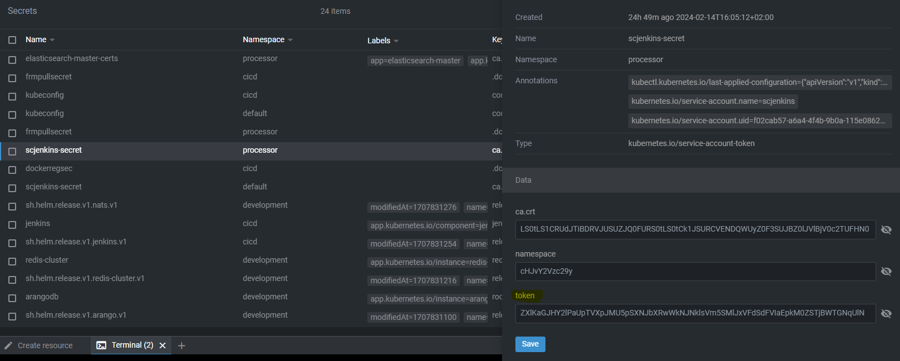
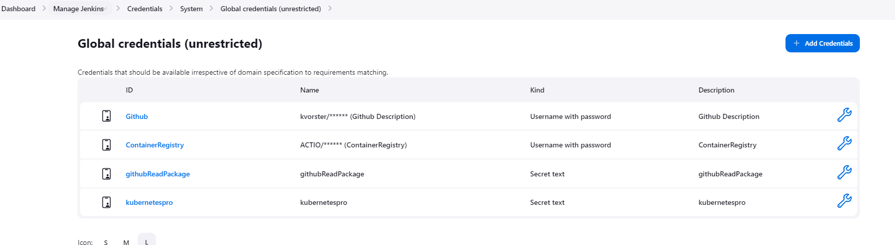

#### Adding Managed Files for NPM Configuration in Jenkins

**Navigate to Manage Jenkins → Managed files**

[https://docs.github.com/en/packages/learn-github-packages/about-permissions-for-github-packages#about-scopes-and-permissions-for-package-registries](https://docs.github.com/en/packages/learn-github-packages/about-permissions-for-github-packages#about-scopes-and-permissions-for-package-registries)

[https://docs.github.com/en/authentication/keeping-your-account-and-data-secure/creating-a-personal-access-token](https://docs.github.com/en/authentication/keeping-your-account-and-data-secure/creating-a-personal-access-token)

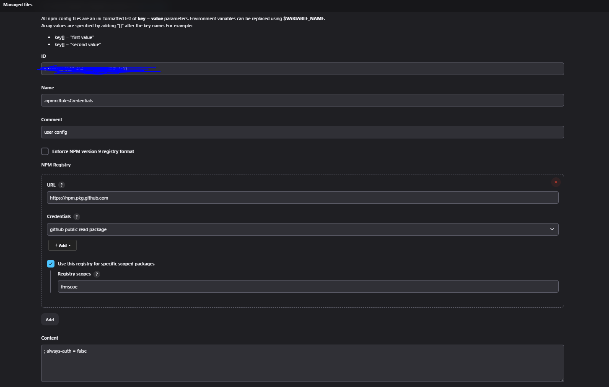

The image shows a Jenkins configuration screen for adding a managed file, specifically an NPM config file (npmrc). Here's a breakdown of the steps and fields:

1. **Managed Files:** This section is for adding configuration files that Jenkins will manage and use across different jobs.
2. **ID:** A unique identifier for the managed file.
3. **Name:** In this case, it's **npmrcRulesCredentials**. This name helps users identify the file's purpose when selecting it for use in a job.
4. **Comment:** An optional field where you can provide additional information about the managed file, such as its intended use. Here, it is described as 'user config'.
5. **Enforce NPM version 9 registry format:** A checkbox that, when checked, enforces the file to be compatible with the NPM version 9 registry format.
6. **Add NPM Registry:**

- **URL:** The registry URL field should be filled with the NPM registry's URL. The provided URL, [**https://npm.pkg.github.com**](https://npm.pkg.github.com), this config is for accessing packages stored in GitHub Package Registry.
- **Credentials:** The dropdown is set to **github public read package**, indicating that the credentials stored in Jenkins should be used to authenticate with this registry.
- **Use this registry for specific scoped packages:** This option indicates that the registry URL and credentials should only be used for packages with a specific scope. In this case, the scope is **frmscoe**.
- **Registry scopes:** Here, you specify the scope for which this registry should be used. Scoped packages are prefixed with the scope in their package name, ie: **frmscoe**.

7. **Content:** The text area labeled 'Content' is where you can input the actual content of the **.npmrc** file. This content typically includes configuration settings like the registry URL, authentication tokens, and various other npm options. **always-auth = false** will not be always required (usually for public registries).

8. **Add:** After configuring all the fields, you would click "Add" to save this managed file configuration.

Once you've added this managed file, Jenkins can use it in various jobs that require npm to access private packages or specific registries. The managed file will be placed in the working directory of the job when it runs, ensuring that npm commands use the provided configuration.

#### Adding Managed Files for Container registry in Jenkins

**Navigate to Manage Jenkins → Managed files**


The image shows a Jenkins configuration screen for adding a managed file, specifically the service account registry. Here's a breakdown of the steps and fields:

1. **Managed Files:** This section is for adding configuration files that Jenkins will manage and use across different jobs.
2. **ID:** A unique identifier for the managed file. ie: registry
3. **Name:** In this case, it's **ServiceAccountConfig**. This name helps users identify the file's purpose when selecting it for use in a job.
4. **Comment:** An optional field where you can provide additional information about the managed file, such as its intended use. Here, it is described as 'user config'.

5. **Content:** The text area labeled 'Content' is where you can input the actual content of the service acount json for the container registry.

6. **Add:** After configuring all the fields, you would click "Add" to save this managed file configuration.

Once you've added this managed file, Jenkins can use it in various jobs that require npm to access private packages or specific registries. The managed file will be placed in the working directory of the job when it runs, ensuring that npm commands use the provided configuration.

#### Jenkins Node.js Configuration

**Navigate to Manage Jenkins → Tools**

- **Name**: Provide a descriptive name for the Node.js installation (e.g., "NodeJS 20.11.0").
- **Install automatically**: Check this option to have Jenkins handle the installation of Node.js automatically on the build agent if it is not already installed.
- **Install from** [http://nodejs.org](http://nodejs.org) : Select this to install Node.js directly from the official Node.js website.
- **Version**: Specify the version of Node.js you require for your projects (e.g., "NodeJS 20.11.0"). Ensure to input a valid version number.
- **Force 32bit architecture**: Check this only if there is a need to install a 32-bit version of Node.js on a 64-bit machine, which is uncommon for most modern applications.
- **Global npm packages to install**: List any npm packages that should be installed globally, **Add** newman
- **Global npm packages refresh hours**: Define how often Jenkins should update the npm package cache. If set to "0", the cache is updated with every build, otherwise, it's updated at the specified interval in hours (e.g., "72" for every three days).

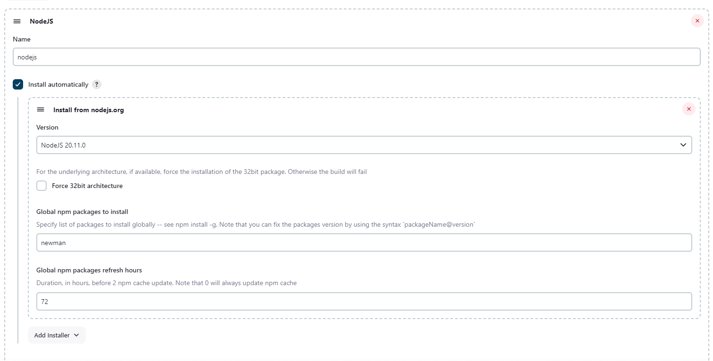

#### Jenkins Docker Installation Configuration

**Navigate to Manage Jenkins → Tools**

- **Name**: Assign a name to the Docker installation to be used as a reference within Jenkins (e.g., "Docker Stable Release").
- **Install automatically**: Enable this setting to have Jenkins take charge of Docker installation on the build agent if Docker isn't already installed.
  - **Download from** [http://docker.com](http://docker.com) : Opt to have Jenkins download Docker directly from the official Docker website.
  - **Docker version**: Specify which version of Docker Jenkins should install. If you want the most recent version, use "latest". Otherwise, provide a specific version number (e.g., "19.03.12").

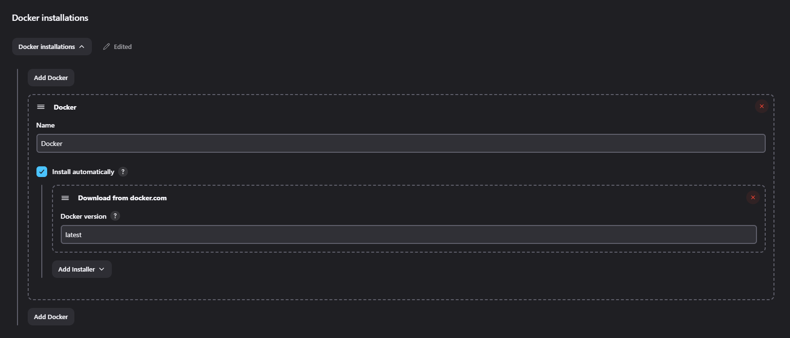

#### Steps to Configure Jenkins Global Variables

1. **Accessing Global Configuration**:

- Go to the Jenkins dashboard and navigate to **Manage Jenkins** > **Configure System**.
- Scroll down to the **Global properties** section.
- Check the box next to **Environment variables** to enable the definition of global environment variables.

2. **Updating Environment Variables**:

- You will find a list of predefined variables, which you may need to update with new values relevant to the current deployment. These variables include configuration URLs, passwords, and tokens required by Jenkins jobs during the deployment process.

**Passwords:** These passwords can be found in your Kubernetes Cluster Secrets, which are autogenerated when the HELM installations are carried out.

**Multiple ArangoDB passwords and endpoints:** The reason we have different names and passwords for ArangoDB is to keep things organized and safe. Each name points to a different part of the database where different information is kept. Just like having different keys for different rooms. This is useful when you have more than one ArangoDB running at the same time and you want to keep them separate. This way, you can connect to just the part you need.

If you have a single database instance you may be wondering why multiple password variants are needed. For example, if my `Configuration`, `Pseudonyms` and `TransactionHistory` databases are served from the same Arango instance, why must I include single quotes in their password input whereas that requirement was not needed in the `ArangoPassword` variable.

The `ArangoPassword` variable is utilised as a CLI argument by `newman`, for setting up the environment. Where it is called, there is some shell substitution of the `ArangoPassword` variable but because the substitution involves a special character, `$`, that has to be surrounded by quotes. 
`newman {omitted} "arangoPassword=${ArangoPassword}" --disable-unicode`

The same reasoning applies to passwords are that explicitly stated to need a single quote around them as they are substituted as is in processors' environments. This means that if your password contains special characters, then you **must** use single quotes to let the decoder know to interpret them as raw strings, or it will be taken as an indication of substitution

3. **Variables and Descriptions**:

- `APMActive`: A flag to enable or disable Application Performance Monitoring.
  - **Default:** True
  - **value:** true / false
- `ArtifactRegistryZone`: A variable used for the gcloud cli.
  - **eg:** us-central1-docker
- `configDbPassword`: A secret password required for accessing the Database which is used for populating the configuration.
  - **eg:** rm]ukXyA@M
- `configDbHost`: Endpoint for the configuration Database.
  - **value:** [http://postgres.development.svc.cluster.local](http://postgres.development.svc.cluster.local)
- `configDbUser`: The user used to access the Database.
  - **eg:** 'admin'
- `configDbPort`: Port for the configuration database
  - **value:** '5432'
- `evalDbPassword`: A secret password required for accessing the Database which is used for populating the evaluation.
  - **eg:** rm]ukXyA@M
- `evalDbHost`: Endpoint for the evaluation Database.
  - **value:** [http://postgres.development.svc.cluster.local](http://postgres.development.svc.cluster.local)
- `evalDbUser`: The user used to access the Database.
  - **eg:** 'admin'
- `evalDbPort`: Port for the configuration database
  - **value:** '5432'
- `rawHisDbPassword`: A secret password required for accessing the Database which is used for populating the Raw History Database.
  - **eg:** rm]ukXyA@M
- `rawHisDbHost`: Endpoint for the configuration Database.
  - **value:** [http://postgres.development.svc.cluster.local](http://postgres.development.svc.cluster.local)
- `rawHisDbUser`: The user used to access the Database.
  - **eg:** 'admin'
- `rawHisDbPort`: Port for the configuration database
  - **value:** '5432'
- `eventHisDbPassword`: A secret password required for accessing the Database which is used for populating the configuration.
  - **eg:** rm]ukXyA@M
- `eventHisDbHost`: Endpoint for the configuration Database.
  - **value:** [http://postgres.development.svc.cluster.local](http://postgres.development.svc.cluster.local)
- `eventHisDbUser`: The user used to access the Database.
  - **eg:** 'admin'
- `eventHisDbPort`: Port for the configuration database
  - **value:** '5432'
- `Branch`: The specific branch in source control that the deployment should target.
  - **value:** main
- `CacheEnabled`: A flag to enable or disable caching.
  - **value:** true / false
- `CacheTTL`: Time-to-live for the cache in seconds.
  - **eg:** 86400
- `ELASTIC_HOST`: The hostname for the Elasticsearch service.
  - **value:** [https://elasticsearch-master.development.svc:9200](https://elasticsearch-master.development.svc:9200)
- `ELASTIC_USERNAME`: The username for accessing Elasticsearch.
  - **value:** elastic
- `ELASTIC_PASSWORD`: The password for accessing Elasticsearch.
  - **eg:** ty6&dabnbh
- `ELASTIC_SEARCH_VERSION`: The version of Elasticsearch in use.
  - **value:** 8.5.1
- `EnableQuoting`: A flag to enable or disable quoting functionality adding Pain messages in the chain.
  - **value:** false
- `FLUSHBYTES`: The byte threshold for flushing data.
  - **value:** 10
- `ImageRepository`: The  for Docker images.
  - **eg:** [example.io](http://example.io)
- `LogLevel`: The verbosity level of logging. **NB:** The single quotes need to be added in.
  - eg: 'info', 'error', 'silent', etc…
- `MaxCPU`: The maximum CPU resource limit.
  - **value:** leave blank
- `NATS_SERVER_TYPE`: The type of NATS server in use.
  - **value:** nats
- `NATS_SERVER_URL`: The URL for the NATS server.
  - **value:** nats.development.svc.cluster.local:4222
- `RedisCluster`: A flag to indicate if Redis is running in cluster mode.
  - **value:** false
- `RedisPassword`: The password for accessing Redis.
  - **eg:** ty6r5\*&p0
- `RedisServers`: The hostname for the Redis Cluster service. **NB:** The single quotes need to be added in to the host string.
  - **value:** '[{"host": "redis-cluster.development.svc.cluster.local", "port":6379}]'
- `Repository`: This parameter specifies the name of a repository
  - **value:** frmscoe

#### Adding Jenkins Jobs

##### Download the Job Configurations:

- Provided is a `jobs.zip` file, which contains job configuration files that you need to add to your Jenkins instance.
- Extract the zip file.

[jobs.zip](../Images/jobs.zip)

##### Navigate to Configuration Directory:

- Open a terminal on your local machine and change the directory to where you have stored the `jobs.zip` file and where you unpack it.

```bash
cd <path to configuration>
```

- `<path to configuration>` is a placeholder for the actual directory path where your `jobs.zip` unzipped files are located.

**eg:** cd "C:\Documents\tasks\Jenkins\jobs"

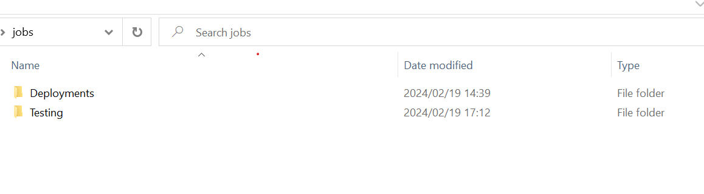

##### Copy Jobs to Jenkins Pod:

- Use the `kubectl cp` command to copy the job configurations from your local machine to the Jenkins pod running in your Kubernetes cluster.

```bash
kubectl cp . <name of pod>:/var/jenkins_home/jobs/ -n cicd
```

- `<name of pod>` is a placeholder for the actual name of your Jenkins pod. You need to replace it with the correct pod name which you can find by running `kubectl get pods -n cicd`.
- The `-n cicd` specifies the namespace where your Jenkins is deployed, which in this case is `cicd`.

##### Finalize the Setup:

- After copying the job configurations, your Jenkins instance should recognize the new jobs. Jenkins will automatically load job configurations found in the `/var/jenkins_home/jobs/` directory.

#### Building Jenkin Agent Locally

**This needs to be completed before adding the Jenkins Cloud agent.**

Please follow the following document to help you build and push the image to the container registry.

[Building the Jenkins Agent Image](https://github.com/frmscoe/docs/blob/main/Technical/Release-Management/building-the-jenkins-image.md) - This link is t show you how to build the docker image , the dockerfile that needs to be used specifically to GC is as follows:

```dockerfile
# Use a base Jenkins agent image
FROM jenkins/inbound-agent:latest as jnlp

USER root

# Update and install necessary packages for adding new repositories
RUN apt-get update && apt-get install -y \
    apt-transport-https \
    gnupg2 \
    curl \
    sudo

# Add Kubernetes package key and set up the repository
RUN echo "deb [signed-by=/etc/apt/keyrings/kubernetes-apt-keyring.gpg] https://pkgs.k8s.io/core:/stable:/v1.28/deb/ /" | sudo tee /etc/apt/sources.list.d/kubernetes.list
RUN curl -fsSL https://pkgs.k8s.io/core:/stable:/v1.28/deb/Release.key | sudo gpg --dearmor -o /etc/apt/keyrings/kubernetes-apt-keyring.gpg

# Add the Google Cloud SDK repository
RUN mkdir -p /usr/share/keyrings && \
    curl https://packages.cloud.google.com/apt/doc/apt-key.gpg | gpg --dearmor -o /usr/share/keyrings/cloud.google.gpg && \
    echo "deb [signed-by=/usr/share/keyrings/cloud.google.gpg] https://packages.cloud.google.com/apt cloud-sdk main" > /etc/apt/sources.list.d/google-cloud-sdk.list

# Update and install required packages
RUN apt-get update

# Install kubectl
RUN apt-get install -qq -y kubectl

# Install Buildah
RUN apt-get install -y buildah

# Install Google Cloud SDK
RUN apt-get install -y google-cloud-sdk

# Switch back to the Jenkins user
USER jenkins
```

#### Setting up a Jenkins cloud agent that will interact with your Kubernetes cluster

- **Navigate to Manage Jenkins → Clouds → Kubernetes**
- **Add the Path to Your Kubernetes Instance**: Enter the URL of your Kubernetes API server in the Kubernetes URL field. This allows Jenkins to communicate with your Kubernetes cluster.
- **Disable HTTPS Certificate Check**: If your Kubernetes cluster uses a self-signed certificate or you are in a development environment where certificate validation is not critical, you can disable the HTTPS certificate check. However, for production environments, it is recommended to use a valid SSL certificate and leave this option unchecked for security reasons.
- **Add Kubernetes Namespace**: Enter `cicd` in the Kubernetes Namespace field. This is where your Jenkins agents will run within the Kubernetes cluster.
- **Add Jenkins URL**: This should be the internal service URL for Jenkins within your Kubernetes cluster, like `http://jenkins.cicd.svc.cluster.local:8080`
- **Add Pod Label**: Labels are key-value pairs used for identifying resources within Kubernetes. Here, you should add a label with the key `jenkins` and the value `agent`. This label will be used to associate the built pods with the Jenkins service.

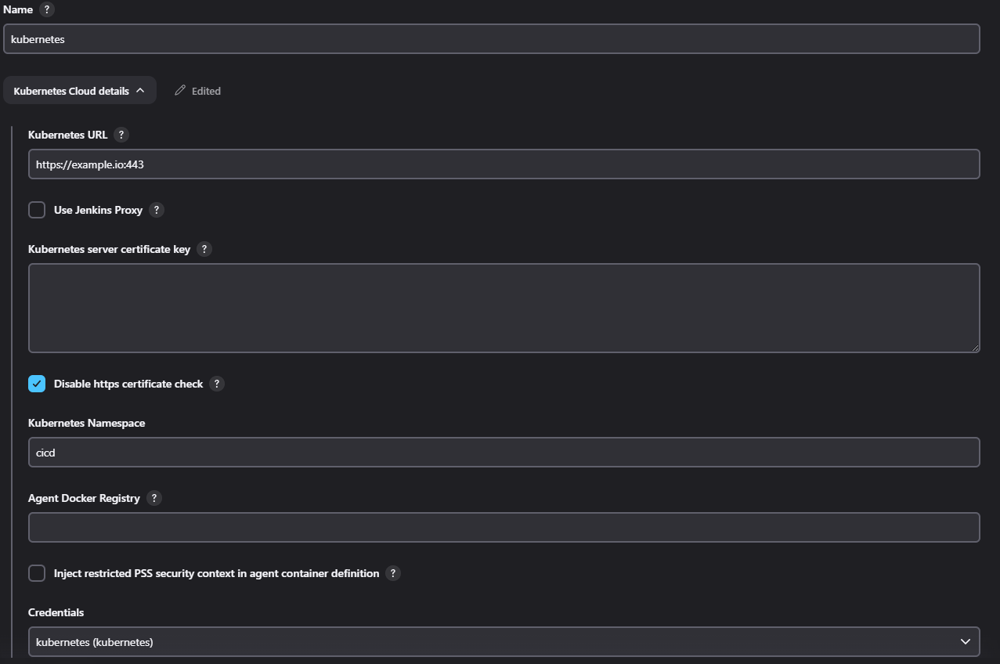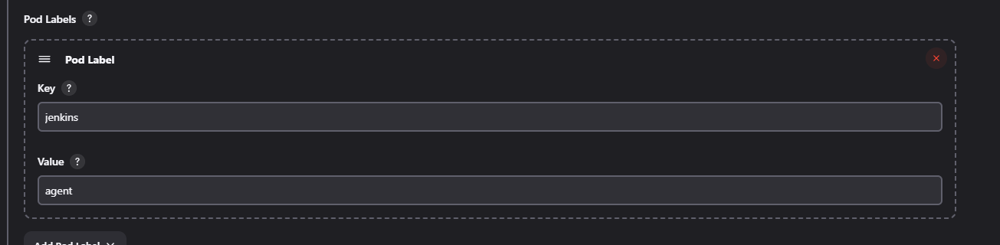

**Add a Pod Template**: This step involves defining a new pod template, which Jenkins will use to spin up agents on your Kubernetes cluster.

- **Name**: Name the pod template `jenkins-builder`. This name is used to reference the pod template within Jenkins pipelines or job configurations.
- **Namespace**: Specify `cicd` as the namespace where the Jenkins agents will be deployed within the Kubernetes cluster.
- **Labels**: Set `jenkins-agent` as the label. This is a key identifier that Jenkins jobs will use to select this pod template when running builds.

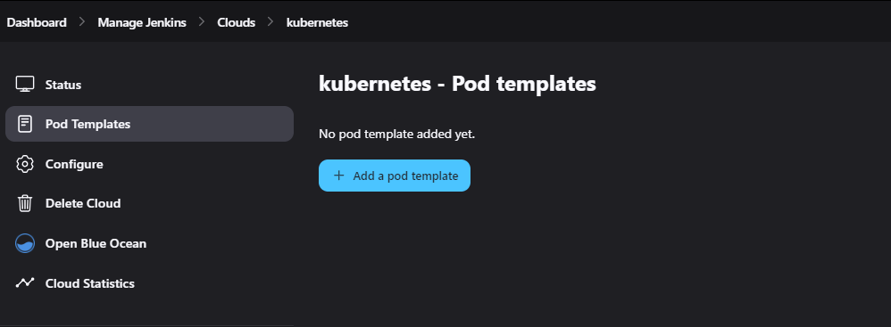

**Add a Container**: In this part of the configuration, you define the container that will run inside the pod created from the pod template.

**NOTE** This needs to point to the docker image built in this step : [Building the Jenkins Agent Image](https://github.com/frmscoe/docs/blob/main/Technical/Release-Management/building-the-jenkins-image.md)

- **Name**: The container name is set to `jnlp`. This is a conventional name for a Jenkins agent container that uses the JNLP (Java Network Launch Protocol) for the master-agent communication.
- **Docker Image**: The Docker image to use is [example.io/jenkins-inbound-agent:1.0.0](http://example.io/jenkins-inbound-agent:1.0.0) . This image is pre-configured with all the necessary tools to run as a Jenkins agent.
- **Always Pull Image**: This option ensures that Jenkins always pulls the latest version of the specified Docker image before starting a build. This is important to keep your build environment up-to-date with the latest changes to the image.
- **Working Directory**: The working directory is set to `/home/jenkins/agent`. This is the directory inside the container where Jenkins will execute the build steps.
- **Command to Run**: This field is left blank, which means the default command from the Docker image will be used to start the agent.

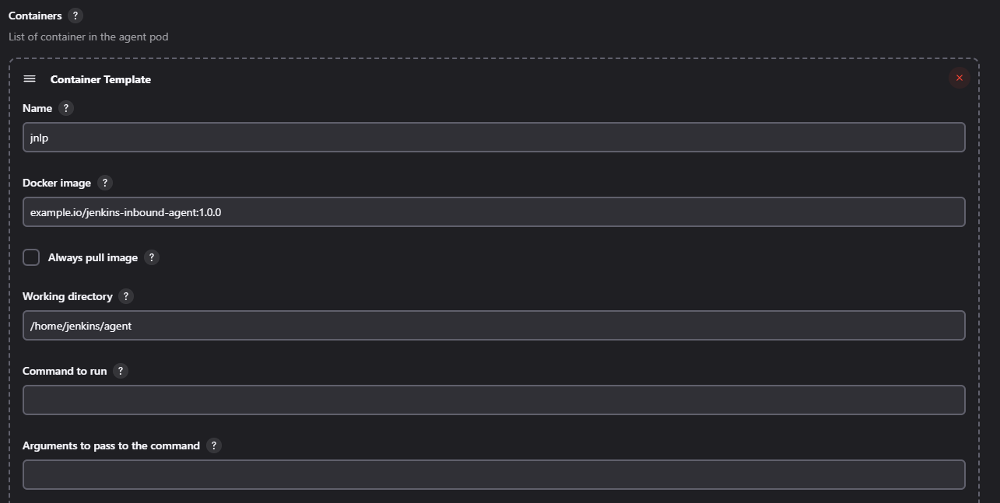

**Run in Privileged Mode**: This is an advanced container setting that allows processes within the container to execute with elevated privileges, similar to the root user on a Linux system.

To select "Run in Privileged Mode" in Jenkins Kubernetes plugin:

1. Within the container configuration, look for the "Advanced..." button or link (not visible in the screenshot) and click it to expand the advanced options.
2. In the advanced settings, find the checkbox labeled "Run in privileged mode" and select it.

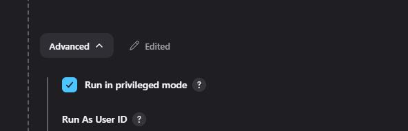

**Image Pull Secret**

Needs to be set to - **frmpullsecret - see screenshot below**

1. **Private Registry Authentication**: If the container images used by your Jenkins jobs are hosted in a private registry, Kubernetes needs to authenticate with that registry. The image pull secret stores the required credentials (like a username and password or token).
2. **Adding Image Pull Secret to Pod Template**:

- Navigate to the Kubernetes cloud configuration within the Jenkins system settings.
- Under the specific pod template that you are configuring, find the `ImagePullSecrets` section.
- Enter the name of the Kubernetes secret that contains your private registry credentials in the `Name` field. This secret should already exist within the same namespace as where your Jenkins builder pods are running.
- If you have multiple registries or need to pull from multiple private sources, you can add additional image pull secrets by clicking on the “Add Image Pull Secret” dropdown and entering the names of these secrets.

3. **YAML Merge Strategy**: The YAML merge strategy determines how Jenkins should handle the YAML definitions from inherited pod templates. If set to 'Override', it means that the current YAML will completely replace any inherited YAML, which could be important if you need to ensure that the image pull secrets are applied without being altered by any inherited configurations.

By properly configuring image pull secrets in your Jenkins Kubernetes pod templates, you enable Jenkins to pull the necessary private images to run your builds within the Kubernetes cluster. Without these secrets, the image pull would fail, and your builds would not be able to run.

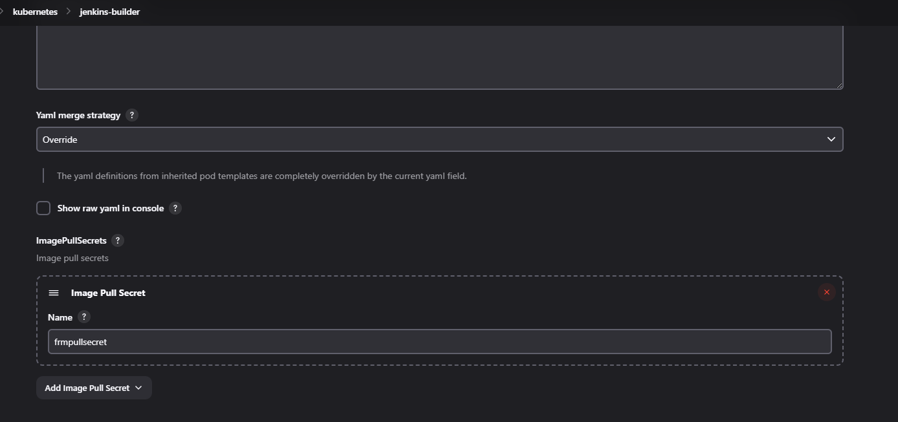

##### Reload Jenkins Configuration:

- You might need to manually reload the Jenkins configuration or restart the Jenkins service for the new job configurations to take effect. This can be done from the Jenkins interface or by restarting the Jenkins pod:

```bash
kubectl rollout restart deployment <jenkins-deployment-name> -n cicd
```

- Make sure to replace `<jenkins-deployment-name>` with the actual deployment name of your Jenkins instance.
- You can also safeRestart through the URL.

**eg:** [http://localhost:52933/safeRestart](http://localhost:52933/safeRestart)

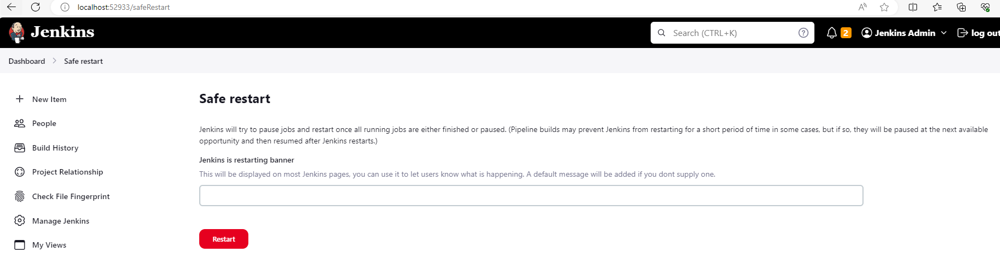

# Running Jenkins Jobs to Install Processors

### Overview

The process involves configuring Jenkins to deploy various processors into the Tazama cluster. These processors are essential components of the system and require specific configurations, such as database connections and service endpoints, to function correctly.

### Edit Jobs: Configuring Credentials and Kubernetes Endpoints in Jenkins

After importing the Jenkins jobs, you need to configure each job with the appropriate credentials and Kubernetes server endpoint details. This setup is crucial to ensure that each job has the necessary permissions and access to interact with other services and the Kubernetes cluster.

#### Configuring Rule Processors:

1. **Access Each Rule Processor Job:**

- Navigate to the job configuration for each rule processor, such as TMS, Typology, etc.
- Within each job, look for the section where you can define or edit the repository from which the job will fetch the code or artifacts.

2. **Repository Configuration:**

- Set the **Repository URL** to the Git repository where the code for the processor is located. This is typically a URL like https://github.com/<Repository>/event-director/.
- Under Credentials, select the appropriate credentials from the drop-down list, such as **Github Creds**, which should correspond to the credentials that have access to the repository.

3. **Binding Credentials:**

- Under the **Bindings** section, define the environment variables that the job will use internally.
- For username and password types, such as container registry credentials, set the appropriate **Username Variable** and **Password Variable**. Use **REG\_USER** and **REG\_PASS** for registry credentials.
- Choose the specific credentials from the drop-down list, like **Login info for the Sybrin Azure container registry.**
- For secret texts, such as a GitHub access token, set the Variable to an environment variable name, such as **READ\_GH\_TOKEN**, and select the appropriate credentials, like **github public read package**.

By completing these steps, you ensure that each Jenkins job can access the necessary repositories and services with the correct permissions and interact with your Kubernetes cluster using the right endpoints and credentials. It's essential to review and verify these settings regularly, especially after any changes to the credentials or infrastructure.

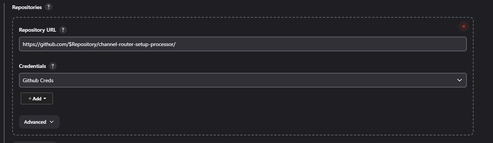
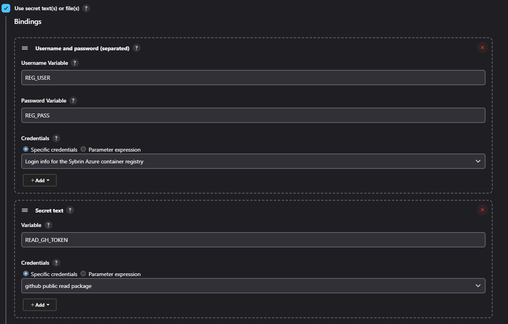
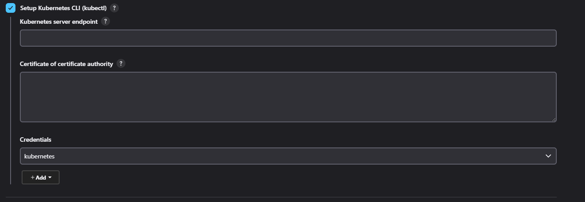

### Deploying to the Cluster:

**Dashboard → Deployments → Jenkins Agent → Pipelines→ Deploying All Rules and Rule Processors**

Run the Jenkins jobs that deploy the processors to the Tazama cluster. These jobs will reference the global environment variables you've configured, ensuring that each processor has the required connections and configurations.

Run the **Deploying All Rules and Rule Processors Pipeline Job**

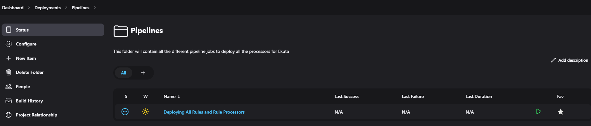

### End-to-End Platform Testing with the "E2E Test" Jenkins Job

**Dashboard → Testing→ E2E Test**

#### Overview of the "E2E Test" Job

The "E2E Test" job in Jenkins is an essential component for ensuring the integrity and robustness of the platform. It is specifically designed to perform comprehensive end-to-end testing, replicating user behaviors and interactions to verify that every facet of the platform functions together seamlessly.

#### Purpose and Benefits

- **Comprehensive Assessment:** The E2E Test tests all aspects of the platform, from individual services to data processing, ensuring that all integrated components are operating together.
- **Confidence in Releases:** Successful E2E tests will display the stability and readiness of the platform for production releases.

#### Running the Test and Post-Test Evaluation

- **Update your endpoints:** Update both the 'ofUrl' and the 'arangoUrl' used by your ingresses .
- **Test Execution:** Trigger the E2E Test job.
- **Monitoring Results:** Jenkins provides an overview of the job's results, including the last successful run, failures, and test durations.
- **Post-Test Actions:** Upon completion of the E2E Test, it's crucial to examine the **evaluationResults** database within ArangoDB.
- Navigate to the **transactions** collection within the database.
- Confirm the presence of a transaction record, which signifies a successful end-to-end test execution.

If for some reason the E2E jobs doesnt run double check your variables in the configuration of the job, if it still doesnt work you can use postman to test the E2E.

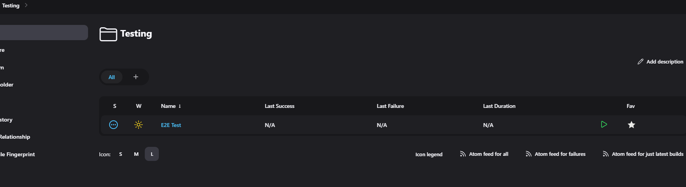
